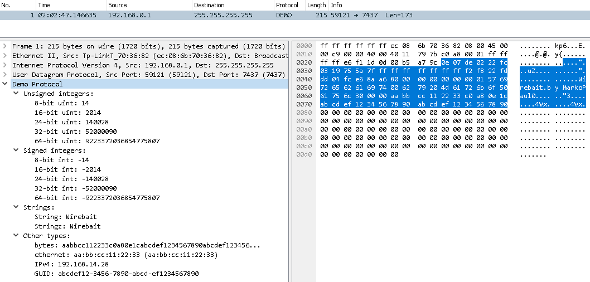

# [WireBait](https://github.com/MarkoPaul0/WireBait)


[](https://www.gnu.org/licenses/old-licenses/gpl-2.0.en.html)


<!--

-->

Lua library to facilitate the development of [Wireshark](https://www.wireshark.org/) dissectors by enabling users to run them against packet data without Wireshark. The packet data can come from a hexadecimal string or a *.pcap* file.
The goal here is to provide a tool reducing development time when creating a new dissector.

## What does it do?
It simply exposes the [Wireshark Lua API](https://www.wireshark.org/docs/wsdg_html_chunked/wsluarm_modules.html) ([or here](https://wiki.wireshark.org/LuaAPI)) and attempts to reproduce its behavior. As a result, your script becomes "self sufficient" and you can execute it directly and without Wireshark. If you provide it with some data, it will print a text version of the dissection tree along with the payload in hexadecimal format. **Now you can make changes to your dissector and see the effects immediately without leaving your Lua IDE!**

## Requirements
  * You have a Lua interpreter 5.3
  * You have a dissector and data to test it (hex string or pcap file)
  * You have a Lua debugger (I like [ZeroBrane Studio](https://studio.zerobrane.com/)) [only a requirement for step by step debugging]
  
Note that WireBait does not interact at all with Wireshark.

## Quick start
Getting started takes less than a minute:
  1. Add **wirebait.lua** somewhere in your Lua path
  2. Add the following snippet of code on top of the script you want to run/debug:
```lua
    if disable_lua == nil and not _WIREBAIT_ON_ then
      local wirebait = require("wirebait");
      local dissector_tester = wirebait.plugin_tester.new({only_show_dissected_packets=true});
      dissector_tester:dissectPcap("path_to_your_pcap_file.pcap");  --dissecting data from a pcap file
      dissector_tester:dissectHexData("72ABE636AFC86572");	    --dissecting data from a hex string	
      return
    end
```
  3. Edit the code snippet to have your dissector read the *hexadecimal data* **and/or** *pcap file* of your choice
  4. Execute your dissector script. Enjoy :smiley:
  
 ## Example 1 Dissecting Data from a Hexadecimal String
  If you run the example dissector script **[demo_dissector.lua](example/demo_dissector.lua)**, which dissects the data provided as an hexadecimal string, you should get the following output:
  ```
------------------------------------------------------------------------------------------------------------------------------[[
Dissecting hexadecimal data (no pcap provided)

 0E 07 DE 02 22 FC 03 19   75 5A 7F FF FF FF FF FF  |  Demo Protocol
 FF FF F2 F8 22 FD DD 04   FC E6 8A A6 80 00 00 00  |  └─ Unsigned integers:
 00 00 00 01 57 69 72 65   62 61 69 74 00 62 79 20  |     └─ 8-bit uint: 14
 4D 61 72 6B 6F 50 61 75   6C 30 00 00 AA BB CC 11  |     └─ 16-bit uint: 2014
 22 33 C0 A8 0E 1C AB CD   EF 12 34 56 78 90 AB CD  |     └─ 24-bit uint: 140028
 EF 12 34 56 78 90 00 00   00 00 00 00 00 00 00 00  |     └─ 32-bit uint: 52000090
 00 00 00 00 00 00 00 00   00 00 00 00 00 00 00 00  |     └─ 64-bit uint: 9223372036854775807
 00 00 00 00 00 00 00 00   00 00 00 00 00 00 00 00  |  └─ Signed integers:
 00 00 00 00 00 00 00 00   00 00 00 00 00 00 00 00  |     └─ 8-bit int: -14
 00 00 00 00 00 00 00 00   00 00 00 00 00 00 00 00  |     └─ 16-bit int: -2014
 00 00 00 00 00 00 00 00   00 00 00 00 00           |     └─ 24-bit int: -140028
                                                     |     └─ 32-bit int: -52000090
                                                     |     └─ 64-bit int: -9223372036854775807
                                                     |  └─ Strings:
                                                     |     └─ String: Wirebait
                                                     |     └─ Stringz: Wirebait
                                                     |  └─ Other types:
                                                     |     └─ bytes: aabbcc112233c0a80e1cabcdef1234567890abcdef1234567890...
                                                     |     └─ ethernet: aa:bb:cc:11:22:33
                                                     |     └─ IPv4: 192.168.14.28
                                                     |     └─ GUID: abcdef12-3456-7890-abcd-ef1234567890
]]------------------------------------------------------------------------------------------------------------------------------
  ```
**In wireshark the same dissection would look like this:**



**Something to note is that the hex string only contains the IP payload**, i.e. only the data to be dissected. No need to worry about adding ethernet, IP, TCP/UDP, headers.

 ## Example 2 Dissecting Data from a *.pcap* File
  If you run the example dissector script **[demo_dissector2.lua](example/demo_dissector2.lua)**, which dissects the same data as in the first example but provided by the **[demo.pcap](example/captures/demo.pcap)** file, you should get the same dissection output. One difference is that you will also get packet information that is provided by ethernet, IP, and TCP/UDP headers:
 ```
------------------------------------------------------------------------------------------------------------------------------[[
No.         | Time                | Source            | Destination       | Protocol  | Length    | Info          
1           | 02:02:47.146635     | 192.168.0.1       | 255.255.255.255   | Demo      | 173       | 59121 → 7437  Len=173 

 0E 07 DE 02 22 FC 03 19   75 5A 7F FF FF FF FF FF  |  Demo Protocol
 FF FF F2 F8 22 FD DD 04   FC E6 8A A6 80 00 00 00  |  └─ Unsigned integers:
 .......<trimmed output, same as example 1>
 ```

## State of the project
A few notes about the current state of the project:
  * Only compatible with Lua 5.3
  * TCP reassembly is not supported
  * Only "*.pcap*" files are supported
  * Pcap files must be written in native byte order
  
For more information you can check what I'm up to in the [Project section](https://github.com/MarkoPaul0/WireBait/projects/1).
  

# Licensing 
WireBait for Wireshark is a lua package to help create Wireshark Dissectors
Copyright (C) 2015-2017 Markus Leballeux

This program is free software; you can redistribute it and/or modify
it under the terms of the GNU General Public License as published by
the Free Software Foundation; either version 2 of the License, or
(at your option) any later version.

This program is distributed in the hope that it will be useful,
but WITHOUT ANY WARRANTY; without even the implied warranty of
MERCHANTABILITY or FITNESS FOR A PARTICULAR PURPOSE.  See the
GNU General Public License for more details.

You should have received a copy of the GNU General Public License along
with this program; if not, write to the Free Software Foundation, Inc.,
51 Franklin Street, Fifth Floor, Boston, MA 02110-1301 USA.
**(Checkout the full [license](LICENSE.txt))**
