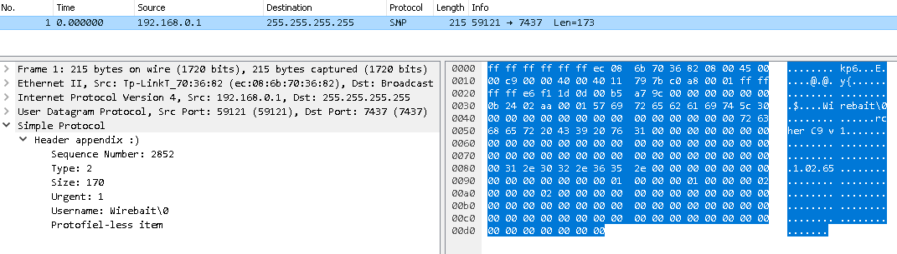

# [WireBait](https://github.com/MarkoPaul0/WireBait)


[](https://www.gnu.org/licenses/old-licenses/gpl-2.0.en.html)


Lua library to facilitate the development of [Wireshark](https://www.wireshark.org/) dissectors by enabling users to run them against packet data without Wireshark. The packet data can come from a hexadecimal string or a *.pcap* file.
The goal here is to provide a tool reducing development time when creating a new dissector.

## What does it do?
It simply exposes the [Wireshark Lua API](https://www.wireshark.org/docs/wsdg_html_chunked/wsluarm_modules.html) ([or here](https://wiki.wireshark.org/LuaAPI)) and attempts to reproduce its behavior. Instead of displaying the dissected packet in a GUI, it prints a text version of the tree along with the payload in hexadecimal format.

## Requirements
  * You have a Lua interpreter 5.3
  * You have a dissector and data to test it (hex string or pcap file)
  * You have a Lua debugger (I like [ZeroBrane Studio](https://studio.zerobrane.com/)) [only a requirement for step by step debugging]
  
Note that WireBait does not interact at all with Wireshark.

## Quick start
Getting started takes less than a minute:
  1. Add **wirebait.lua** somewhere in your Lua path
  2. Add the following snippet of code on top of the script you want to run/debug:
```lua
    if disable_lua == nil and not _WIREBAIT_ON_ then
      local wirebait = require("wirebait");
      local dissector_tester = wirebait.plugin_tester.new({only_show_dissected_packets=true});
      dissector_tester:dissectPcap("path_to_your_pcap_file.pcap");  --dissecting data from a pcap file
      dissector_tester:dissectHexData("72ABE636AFC86572");	    --dissecting data from a hex string	
      return
    end
```
  3. Edit the code snippet to have your dissector read the *hexadecimal data* **and/or** *pcap file* of your choice
  4. Execute your dissector script. Enjoy :smiley:
  
 ## Example 1 Dissecting Data From a Hexadecimal String
 If you run the example dissector script **[smp_dissector_ex1.lua](example/smp_dissector_ex2.lua)**, which dissects the data provided as an hexadecimal string, you should get the following output:
```
 ------------------------------------------------------------------------------------------------------------------------------[[
Dissecting hexadecimal data (no pcap provided)
	 00 00 00 00 00 00 0B 24   02 AA 00 01 57 69 72 65	|	Simple Protocol
	 62 61 69 74 5C 30 00 00   00 00 00 00 00 00 00 00	|	└─ Header appendix :)
	 00 00 00 00 72 63 68 65   72 20 43 39 20 76 31 00	|	   └─ Sequence Number: 2852
	                                                	|	   └─ Type: 2
	                                                	|	   └─ Size: 170
	                                                	|	   └─ Urgent: 1
	                                                	|	   └─ Username: Wirebait\0
	                                                	|	└─ Protofield-less item
	                                                	|	└─ Child 1 Protofield-less item
	                                                	|	   └─ Child 2 Protofield-less item
	                                                	|	      └─ Child 3 Protofield-less item
	                                                	|	         └─ Child 4 Protofield-less item
]]------------------------------------------------------------------------------------------------------------------------------
```
 
 ## Example 2 Dissecting Data From a *.pcap* File
 If you run the example dissector script **[smp_dissector_ex2.lua](example/smp_dissector_ex2.lua)**, which dissects the provided **[smp_sample.pcap](example/smp_sample.pcap)** file, you should get the following output:
```
------------------------------------------------------------------------------------------------------------------------------[[
Frame# 1: UDP packet from 192.168.0.1:59121 to 255.255.255.255:7437
	 00 00 00 00 00 00 0B 24   02 AA 00 01 57 69 72 65	|	Simple Protocol
	 62 61 69 74 5C 30 00 00   00 00 00 00 00 00 00 00	|	└─ Header appendix :)
	 00 00 00 00 72 63 68 65   72 20 43 39 20 76 31 00	|	   └─ Sequence Number: 2852
	 00 00 00 00 00 00 00 00   00 00 00 00 00 00 00 00	|	   └─ Type: 2
	 00 00 00 00 00 00 00 00   00 00 00 00 00 00 00 00	|	   └─ Size: 170
	 00 00 00 00 00 00 00 31   2E 30 32 2E 36 35 2E 00	|	   └─ Urgent: 1
	 00 00 00 00 00 00 00 00   00 00 00 00 00 01 00 00	|	   └─ Username: Wirebait\0
	 00 01 00 00 00 02 00 00   00 02 00 00 00 00 00 00	|	└─ Protofield-less item
	 00 00 00 00 00 00 00 00   00 00 00 00 00 00 00 00	|	└─ Child 1 Protofield-less item
	 00 00 00 00 00 00 00 00   00 00 00 00 00 00 00 00	|	   └─ Child 2 Protofield-less item
	 00 00 00 00 00 00 00 00   00 00 00 00 00       	|	      └─ Child 3 Protofield-less item
	                                                	|	         └─ Child 4 Protofield-less item
]]------------------------------------------------------------------------------------------------------------------------------
```

  In wireshark the same dissection would look like this:
  
  

## State of the project
A few notes about the current state of the project:
  * Only compatible with Lua 5.3
  * TCP reassembly is not supported
  * Only "*.pcap*" files are supported
  * Pcap files must be written in native byte order
  
For more information you can check what I'm up to in the [Project section](https://github.com/MarkoPaul0/WireBait/projects/1).
  

# Licensing 
WireBait for Wireshark is a lua package to help create Wireshark Dissectors
Copyright (C) 2015-2017 Markus Leballeux

This program is free software; you can redistribute it and/or modify
it under the terms of the GNU General Public License as published by
the Free Software Foundation; either version 2 of the License, or
(at your option) any later version.

This program is distributed in the hope that it will be useful,
but WITHOUT ANY WARRANTY; without even the implied warranty of
MERCHANTABILITY or FITNESS FOR A PARTICULAR PURPOSE.  See the
GNU General Public License for more details.

You should have received a copy of the GNU General Public License along
with this program; if not, write to the Free Software Foundation, Inc.,
51 Franklin Street, Fifth Floor, Boston, MA 02110-1301 USA.
**(Checkout the full [license](LICENSE.txt))**
